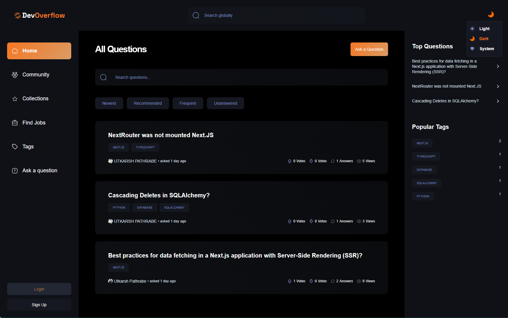
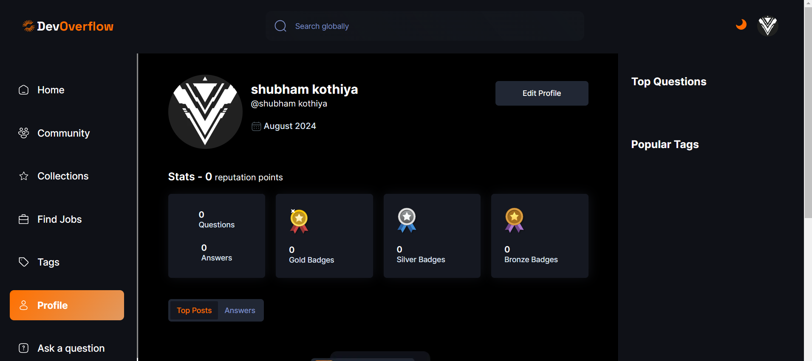

# Dev Overflow - StackOverflow Clone

Welcome to Dev Overflow - a comprehensive StackOverflow-like platform. This app is built with Next.js, utilizing cutting-edge web development techniques to provide a feature-rich experience.

## Features:
### Next.js Implementation: 
 Utilized Next.js to implement SSR and SSG, enhancing performance and SEO, crucial for a high-traffic platform like stack overflow.
### UI/UX Optimization: 
 Created a fully responsive design using Tailwind CSS, ensuring a seamless experience across devices. Also Leveraged Radix UI to build accessible and interactive components, ensuring compliance with web accessibility standards.
### Robust Form Handling and Validation:
 Implemented efficient form handling with React Hook Form, combined with Zod for TypeScript-first schema validation, ensuring data integrity and improving user experience.
### AI-Powered Features:
 Integrated OpenAI to generate automated answers to incorporate cutting-edge AI technologies into web applications.
### Recommendation System:
 Unique system for recommending posts.
### Scalable Data Management:
 Designed a scalable database architecture using MongoDB and Mongoose, enabling efficient data storage and retrieval for a dynamic content platform.
### Interactive User Engagement Features:
 Developed a user recognition system with ***badges and reputation points***, encouraging community participation and enhancing user engagement.
### Views and Voting Mechanism:
 Engaging user interaction features.
### Filter and Pagination:
 Enhanced search capabilities for a seamless experience.

## Technologies Used:

- **NMongoDB**: Document database for storing and managing app data.
- **ESLint**: JavaScript linting tool for code consistency and error checking.
- **ReactJS**: JavaScript library for building interactive UIs.
- **Mongoose**: Object Data Modeling (ODM) library for MongoDB and Node.js.
- **Next.js**: React framework for server-side rendering and routing.
- **Prettier**: Code formatter for ensuring consistent code style.
- **RapidAPI**: Platform for accessing external APIs.
- **Tailwind CSS**: Utility-first CSS framework for quick styling.
- **Zod**: TypeScript-first schema validation library for form handling.
- **React Hook Form**: React library for building forms with hooks.
- **Radix UI**: Design system for building accessible UI components.
- **ClerkAuth**: Authentication service for user authentication and management.
- **Shadcn UI**: UI library for creating interactive components and animations.
- **TypeScript**: Statically typed superset of JavaScript for enhanced code quality.

Explore the source code and delve into the world of modern web development with Dev Overflow!

### Home Page

### Profile Page

